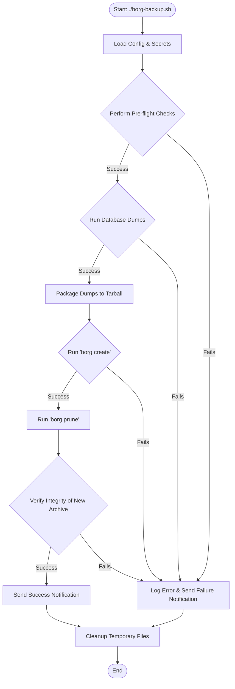

# Borg Backup Automation Script

***

# Borg Backup Automation Script
This script automates reliable, secure, and efficient backups using BorgBackup—with a focus on real-world usability. It’s built for systems that run containerized applications (especially via Docker Compose) and need both filesystem and database backups in one streamlined process.

## What It Does
-   **Smart, automated backups: Creates encrypted, deduplicated, and versioned backups of your chosen directories
-   **Automatic database dumps: Detects running MariaDB, MySQL, PostgreSQL, and InfluxDB containers and safely dumps their data before backing it up.
-   **Easy to configure: All settings live in a clean, well-commented config file—no code changes required.
-   **Security-first: Sensitive credentials are kept in a separate, permission-locked secrets file and never exposed in logs or command lines.
-   **Safe execution: Before starting, it checks system health—like available disk space and CPU load—to avoid backups that could destabilize your system.
-   **Built-in verification: After each backup, it runs integrity checks to confirm your data is not just stored, but actually restorable.
-   **Prevents conflicts: Uses file locking to ensure only one backup runs at a time—no race conditions or overlapping jobs.
-   **Keeps you informed: Optional Discord notifications let you know immediately if a backup succeeds or fails.

***

## 🚀 Setup Guide

Getting started involves three main steps: installing dependencies, creating a configuration file, and creating a secrets file.

### Step 1: Install Dependencies

Ensure the following command-line tools are installed on your system. The script will verify their existence on startup.

```bash
# For Debian/Ubuntu-based systems
sudo apt-get update && sudo apt-get install borgbackup jq coreutils util-linux file sqlite3
```

### Step 2: Create the Configuration File

Create a file named `borg-backup.conf` in the same directory as the `borg-backup.sh` script. This file defines *what* and *how* to back up.

Below is a minimal, working example. Copy this and replace the placeholder paths with your own.

```bash
#
# /path/to/script/borg-backup.conf
#
# === Minimal Configuration ===
#

# --- (Required) Core Paths ---
# The absolute path to your Borg repository (can be local or remote via SSH).
BORG_REPO="/mnt/backups/borg-repo"

# An absolute path to a temporary working directory for dumps and logs.
STAGING_DIR="/var/tmp/borg-staging"

# --- (Required) Backup Sources ---
# An array of absolute paths on the host system to be backed up.
BACKUP_DIRS=("/var/www" "/home/user/documents")

# --- (Required) Docker Integration ---
# Absolute path to the docker-compose file that defines your database services.
DOCKER_COMPOSE_FILE="/opt/docker/docker-compose.yml"

# --- (Required) Database Definitions ---
# For each database container you want to back up, call the add_database helper.
# Usage: add_database "container_name" "database_type" "username"
add_database "app-mariadb"   "mariadb"    "root"
add_database "app-postgres"  "postgres"   "postgres"
add_database "influxdb" "influxdb" # Only v1.8, no username required

# --- More options like retention days, compression, and exclusions can be
# --- configured. See the top of the `lib/config.sh` file for a full list
# --- of available variables and their default values.
```

### Step 3: Create the Secrets File

Create a file to store your sensitive credentials. By default, the script looks for this at `/root/borg-backup.env`.

**This file MUST be secured, or the script will refuse to run:**
```bash
sudo touch /root/borg-backup.env
sudo chmod 600 /root/borg-backup.env
sudo chown root:root /root/borg-backup.env
```

Below is a minimal example you can copy and modify.

```bash
/root/borg-backup.env
#=== Example Secrets File ===
#--- (Required) Borg Repository Passphrase ---
#This is the master encryption key for your entire backup repository.
#Keep this somewhere safe. If you lose it, your backups are unrecoverable.
BORG_PASSPHRASE="your-long-and-very-secure-borg-passphrase"
#--- (Required) Database Passwords for each add_database line ---
#The variable name is constructed as: SECURE_<CONTAINER_NAME>_PASSWORD
#The container name is converted to UPPERCASE and hyphens (-) are replaced with underscores (_).
SECURE_APP_MARIADB_PASSWORD="your-mariadb-root-password"
#...
```

Step 4: Initialize the Repository & Run
If this is a new repository, you must initialize it once. The script will try to do this automatically, but you can also do it manually.

```Bash
# Set the passphrase in your environment just for this one command
export BORG_PASSPHRASE="your-long-and-very-secure-borg-passphrase"

# Initialize the repository (use the same path as in your .conf file)
borg init --encryption=repokey-blake2 /mnt/backups/borg-repo

# Unset the passphrase from your environment
unset BORG_PASSPHRASE
```

You are now ready to run your first backup!

```Bash
sudo ./borg-backup.sh

Usage & Command-Line Options
The script accepts several command-line flags to modify its behavior.
Flag	Description
--dry-run	Simulate all operations without making any actual changes to the repository.
--check-only	Run all pre-flight health and configuration checks, then exit. Useful for validating your setup.
--no-prune	Skip the pruning of old archives after the backup is complete.
--repo-check	Performs a full borg check --verify-data on the entire repository before starting the backup.
--check-sqlite	After a backup, finds and verifies all SQLite databases within your Docker app data directory.
--verify-only	Skips the backup process and runs integrity verification on an existing archive.
--archive <name>	Used with --verify-only to specify an archive name. If omitted, the latest archive is used.
--debug	Enables verbose debug logging for troubleshooting.
--help	Displays this help message.
```

The diagram below illustrates the sequence of operations during a standard backup run.

